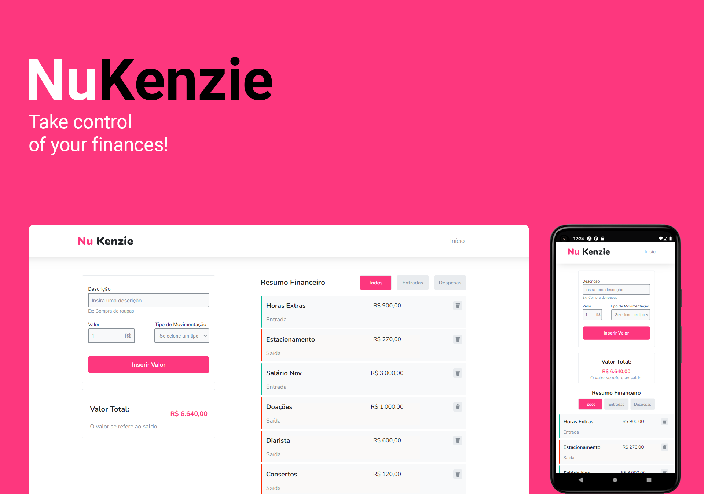

<h1 align="center">
  
</h1>
<br>
<p align="center">
  <a href="#-projeto">Projeto</a>&nbsp;&nbsp;&nbsp;|&nbsp;&nbsp;&nbsp;
  <a href="#-tecnologias">Tecnologias</a>&nbsp;&nbsp;&nbsp;|&nbsp;&nbsp;&nbsp;
  <a href="#-features">Features</a>&nbsp;&nbsp;&nbsp;|&nbsp;&nbsp;&nbsp;
  <a href="#-layout">Layout</a>&nbsp;&nbsp;&nbsp;|&nbsp;&nbsp;&nbsp;
  <a href="#-executando-o-projeto">Executando o projeto</a>&nbsp;&nbsp;&nbsp;|&nbsp;&nbsp;&nbsp;
  <a href="#memo-licença">Licença</a>
</p>

<br>


<p align="center">
  
  
  
  
</p>

<p align="center">
  <a href="https://nlw-return-impulse-tawny-rho.vercel.app/">Clique aqui</a> para acessar a versão web
</p>

## ✨ Projeto

FeedGet é um aplicativo de feedbacks, desenvolvido 100% responsivo para ser integrado a qualquer aplicação web ou mobile. O usuário consegue além de escolher a categoria de seu feedback, também pode enviar uma mensagem personalizada junto a uma captura de tela automática. O administrador da aplicação recebe os feedbacks via-e-mail.

## 🚀 Tecnologias

Esse projeto foi desenvolvido com as seguintes tecnologias:

<table border="0">
 <tr>
<td> HTML</td>
<td> CSS</td>
<td> JavaScript</td>
<td> React.JS</td>
<td> React Native</td>
<td> NodeJS</td>
<td> Prisma</td>
<td> Express</td>
 </tr>
 <tr>
<td> SQLite</td>
<td> PostgreSQL</td>
<td> Expo</td>
<td> TypeScript</td>
<td> Vite</td>
<td> Phosphor Icons</td>
<td> Axios</td></td>
<td> Jest</td>
 </tr>
</table>

## 🌟 Features

-   [ ] Categorias de feedbacks, sendo possível adicionar/remover de forma fácil.
-   [ ] 100% responsivo em resoluções até 4k.
-   [ ] Notificação de novos feedbacks via e-mail.
-   [ ] Captura de tela automática, sem a necessidade de salvar uma imagem.
-   [ ] Versões Web (React) e Mobile (React Native) disponível em Android ou iOS.
-   [ ] Projeto 100% acessível sendo possível por exemplo, utilizá-lo somente pelo teclado, entre outras funções de acessibilidade.

## 🎨 Layout

Você pode visualizar o layout do projeto através [desse link](https://www.figma.com/file/Wvro4wRJXn4Onm9GHX5DFi/Feedback-Widget-(Community)?node-id=100%3A3925). É necessário ter conta no [Figma](https://figma.com) para acessá-lo.

## 👨🏻‍💻 Executando o projeto

Utilize o **yarn** ou o **npm install** para instalar as dependências do projeto.
Em seguida, inicie o projeto.

Iniciando a versão web:

```cl
yarn start ou npm run dev
```

Iniciando a versão mobile:

```cl
expo start
```


## :memo: Licença

Esse projeto está sob a licença MIT. Veja o arquivo [LICENSE](./LICENSE.md) para mais detalhes.

---
